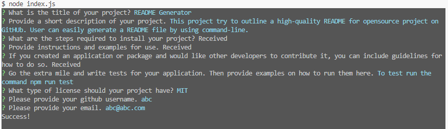

# README Generator

## Description

This project try to outline a high-quality README for opensource project on GitHUb. User can easily generate a README file by using command-line.

## Installation

- Step 1: clone project to your local computer.
- Step 2: run "npm install" to install the required modules.

## Usage

- Step 1: run cmd "node index.js"
- Step 2: input the project title.
- Step 3: input the description.
- Step 4: to input the installation guide for the project, press enter to open the editor. After finished, close and save it.
- Step 5: to input how to use the project, press enter to open the editor. After finished, close and save it.
- Step 6: to input the contribution guideline for the project, press enter to open the editor. After finished, close and save it.
- Step 7: input the test instructions for the project.
- Step 8: choose the license for the project. The license badge will be added to near the top of the README.
- Step 9: input the GitHub username to create the link to the creator of the project profile on GitHub.
- Step 10: input the email address for additional questions.

## Credits

License badges and Badge-maker sourced from [shields.io](https://shields.io/).

Inquirer sourced from [Inquirer](https://github.com/SBoudrias/Inquirer).

## License

This project is licensed under the MIT license.